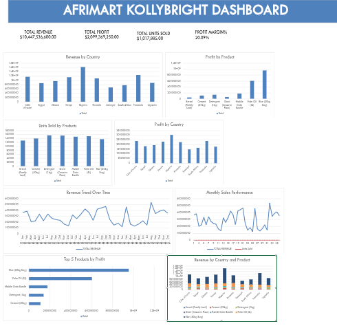

# Afrimart-KollyBright-sales-Dashboard

## Project Overvie
This project analyzes sales data from Afrimart Kolly bright. revenue performance across various countries and products were tracked using Microsoft Excel, Pivot tables and a Dashboard.

---
## Business Question Answered
- What is the total revenue, profit and unit sold?
- Which countries generate the highest revenue?
- Which products are the most profitable?
- How does revenue change over time?
- Which products perform best in different regions?

---
  ## KEY KPIs
- Total Revenue
- Total Profits
- Total Unit Sold

---
## Tools Used
- Microsoft Excel
- Pivot Tables
- Pivot Charts
- Excel Slicers
- Dashboard Design Techniques

  ---
  ## Dashboard Overview
  

---
## Key Insights
- Nigeria contributed the highest share of total revenue.
- Some products recorded high sales volume but lower profit margin.
- Revenue trends show consistent growth over time.
- Product performance varies significantly by Country.
---
## Files in Repository
- [Sales_Dataset](AfriMart_Sales_Dataset_1.xlsx)
- [Dashboard_Screenshot](AFRIMART_DASHBOARD.png)
- README.md

  ---
  ## Coclusion
  This projects demonstrate how raw sales data can be transformed into clear, interactive dashboard that support data driven business decisions. It highlights strong Excel fundamentals, analytical thinking, and professional project documentation.
